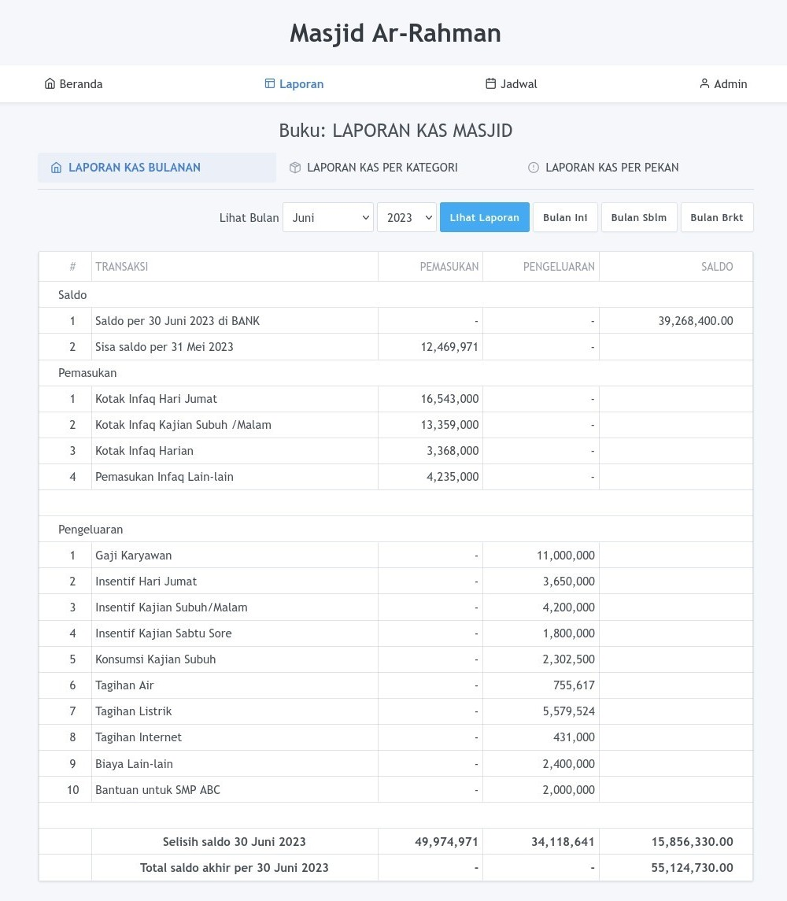
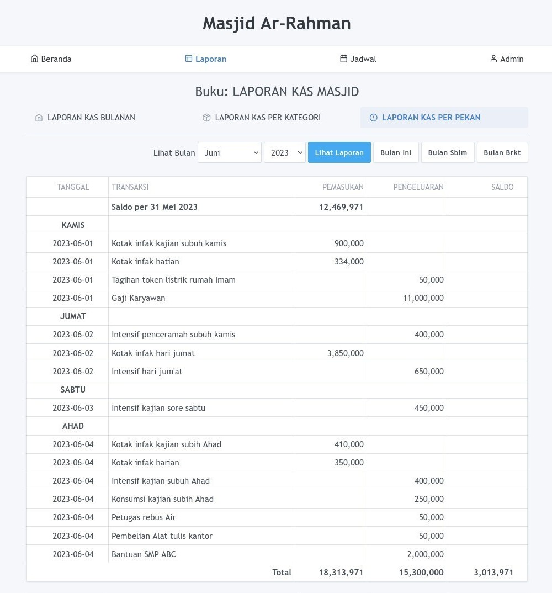
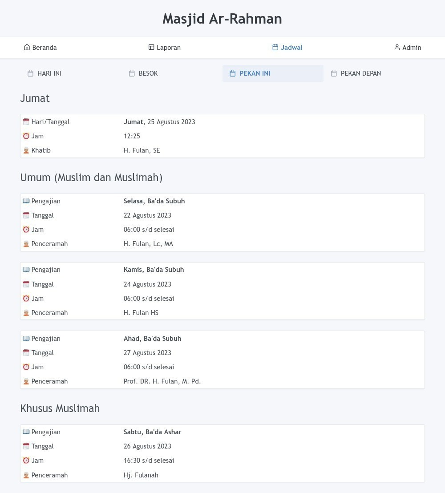

# Buku Masjid

Buku Masjid adalah sistem pengelolaan keuangan dan jadwal pengajian masjid berbasis web yang dibuat dengan framework Laravel.

## Tujuan

- Meningkatkan transparansi laporan keuangan masjid/mushalla.
- Memungkinkan akses online bagi jamaah dan masyarakat umum untuk melihat laporan kas.
- Mempermudah bendahara masjid/mushalla dalam mencatat transaksi keuangan.
- Otomatisasi pembuatan laporan kas setiap kali ada transaksi.
- Mempermudah pengurus masjid/mushalla dalam mengelola jadwal khatib dan pengajian.

## Manfaat

- Meningkatkan kepercayaan jamaah/masyarakat terhadap pengelolaan dana infaq masjid/mushalla.
- Memudahkan masyarakat dalam memutuskan untuk berinfaq ke masjid tertentu.
- Mengurangi beban tugas bendahara dalam pembuatan laporan kas masjid/mushalla.
- Memungkinkan masyarakat/jamaah untuk memantau jadwal pengajian secara online.

## Fitur

1. Pengelolaan buku catatan: Setiap kegiatan dapat dicatat di buku catatan kas yang terpisah.
2. Pengelolaan kategori/kelompok pemasukan dan pengeluaran untuk setiap buku catatan.
3. Input pemasukan dan pengeluaran.
4. Laporan:
   - Laporan kas Bulanan
   - Laporan kas per Kategori
   - Laporan kas Mingguan
5. Pengelolaan jadwal khatib Jumat.
6. Pengelolaan jadwal pengajian rutin.

## Cara Install

Aplikasi ini dapat diinstal pada server lokal maupun online dengan spesifikasi berikut:

### Kebutuhan Server

1. PHP 8.1 (dan sesuai dengan [persyaratan server Laravel 10.x](https://laravel.com/docs/10.x/deployment#server-requirements)).
2. Database MySQL atau MariaDB.
3. SQLite (digunakan untuk pengujian otomatis).

### Langkah Instalasi

1. Clone repositori ini dengan perintah: `git clone https://github.com/buku-masjid/buku-masjid.git`
2. Masuk ke direktori buku-masjid: `$ cd buku-masjid`
3. Instal dependensi menggunakan: `$ composer install`
4. Salin berkas `.env.example` ke `.env`: `$ cp .env.example .env`
5. Generate kunci aplikasi: `$ php artisan key:generate`
6. Buat database MySQL untuk aplikasi ini.
7. Konfigurasi database dan pengaturan lainnya di berkas `.env`.
    ```
    APP_URL=http://localhost
    APP_TIMEZONE="Asia/Makassar"

    DB_DATABASE=homestead
    DB_USERNAME=homestead
    DB_PASSWORD=secret

    MASJID_NAME="Masjid Ar-Rahman"
    MASJID_DEFAULT_BOOK_ID=1
    AUTH_DEFAULT_PASSWORD=password
    ```
8. Jalankan migrasi database: `$ php artisan migrate --seed`
9. Buat kunci passport: `$ php artisan passport:keys`
10. Buat tautan penyimpanan: `$ php artisan storage:link`
11. Mulai server: `$ php artisan serve`
12. Buka web browser dengan alamat web: http://localhost:8000, kemudian masuk dengan akun bawaan:
    ```
    email: admin@example.net
    password: password
    ```

### Langkah Install dengan Docker

Untuk menggunakan docker silahkan jalankan perintah ini di terminal:

1. Buat file .env
    ```bash
    $ cp .env.example .env
    ```
2. Update untuk mengubah env `DB_HOST`:
    ```bash
    DB_HOST=mysql_host
    ```
3. Build docker images dan jalankan container:
    ```bash
    docker-compose build
    docker-compose up -d
    ```
4. Jalankan database migration:
    ```bash
    docker-compose exec server php artisan migrate --seed
    ```
5. Buka web browser dengan alamat web: http://localhost:8000, kemudian login dengan default user:
    ```
    email: admin@example.net
    password: password
    ```
6. Untuk masuk ke docker container shell:
    ```bash
    docker-compose exec server sh
    docker-compose exec mysql bash
    ```

## Screenshot

#### Laporan Bulanan



#### Laporan Per Kategori


#### Laporan Per Pekan



#### Jadwal Pengajian



## Kontribusi

Jika Anda ingin berkontribusi pada proyek ini, kami sangat menghargainya. Berikut beberapa yang dapat Anda lakukan:

1. Laporkan [issue](https://github.com/buku-masjid/buku-masjid/issues) jika Anda menemui kesalahan atau bug.
2. Sampaikan [diskusi](https://github.com/buku-masjid/buku-masjid/discussions) jika Anda ingin mengusulkan fitur baru atau perubahan pada fitur yang sudah ada.
3. Ajukan [pull request](https://github.com/buku-masjid/buku-masjid/pulls) untuk perbaikan bug, penambahan fitur baru, atau perbaikan label.

## Lisensi

Proyek Buku Masjid merupakan perangkat lunak open-source yang dilisensikan di bawah [Lisensi MIT](LICENSE).
