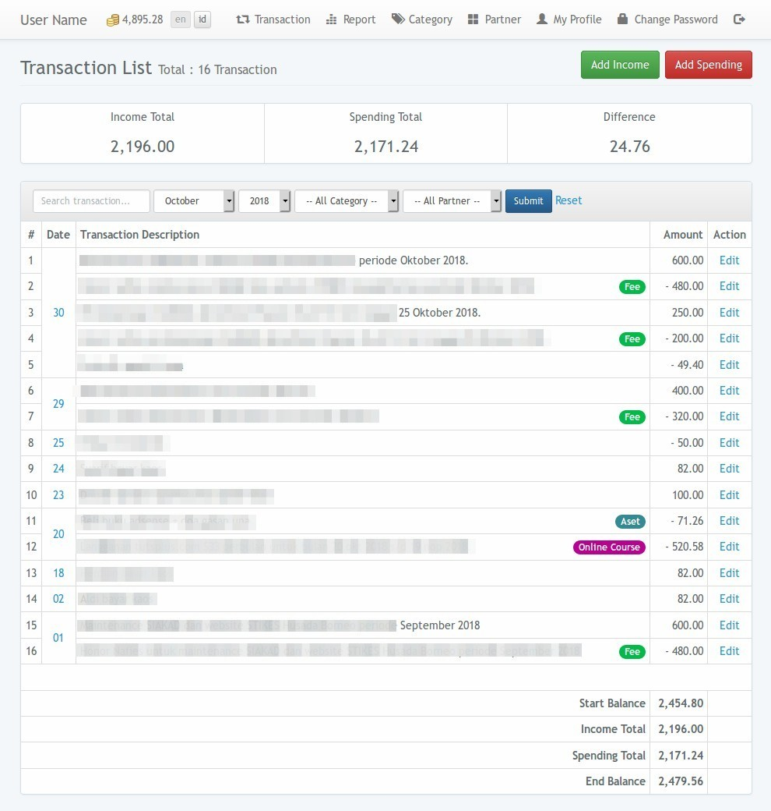
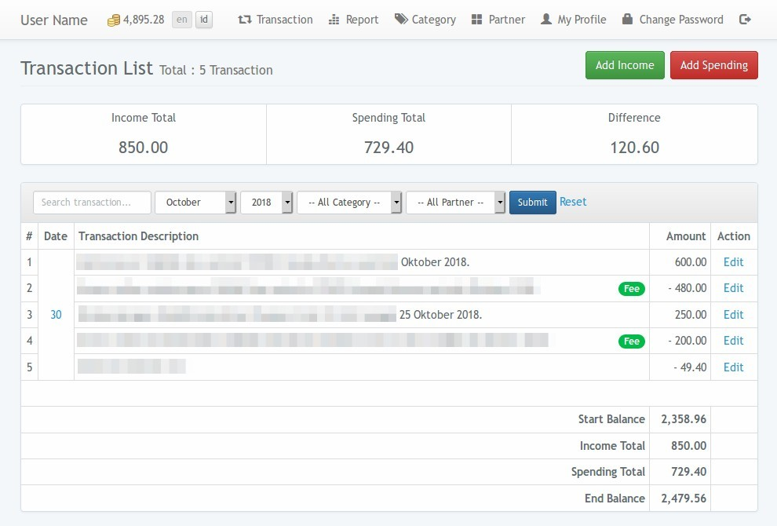
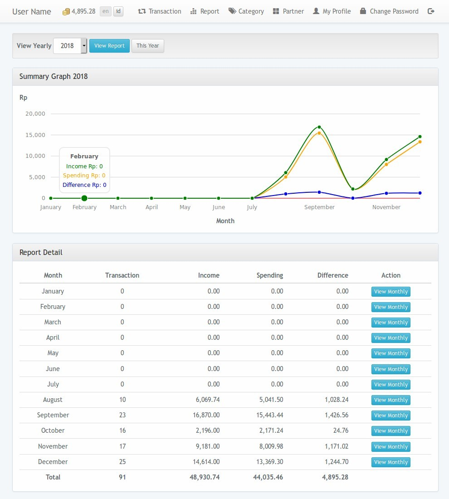

# Dompet

[](https://travis-ci.org/nafiesl/dompet)
[](https://coveralls.io/github/nafiesl/dompet?branch=master)

Dompet is a personal bookkeeping web application, built with Laravel 5.

## Objective
Easy bookkeeping for personal income and spending (amount of money).

## Concept

To aquire our objective, we need this features on the application:

- User can register.
- User can see transaction history by date of their own.
- User add transactions for income and spending.
- User can categorize the transaction.
- User can see transaction summary on each month or a year.
- `-` sign on numbers indicates **spending/outcome** transaction.

Those are basic concept of the personal bookkeeping service.

## Getting Started
This application can be installed on local server and online server with these specifications :

#### Server Requirements
1. PHP >=7.3 (and meet [Laravel 8.x server requirements](https://laravel.com/docs/8.x/deployment#server-requirements)),
2. MySQL or MariaDB database,
3. SQlite (for automated testing).

#### Installation Steps

1. Clone the repo : `git clone https://github.com/nafiesl/dompet.git`
2. `$ cd dompet`
3. `$ composer install`
4. `$ cp .env.example .env`
5. `$ php artisan key:generate`
6. Create new MySQL database for this application  
(with simple command: `$ mysqladmin -urootuser -p create dompet_db`)
7. Set database credentials on `.env` file
8. `$ php artisan migrate`
9. `$ php artisan serve`
10. Register new account.

#### Laravel Passport Setup for REST API

1. Run `php artisan passport:install`, we will get this output.

```
Encryption keys generated successfully.
Personal access client created successfully.
Client ID: 1
Client secret: XQIkbQxxxxxasQHt9YU
Password grant client created successfully.
Client ID: 2
Client secret: IWzI2DvXDxxxxb1kIH
```

2. Set the `Password grant client` on our `.env`.

```
PASSPORT_CLIENT_ID=2
PASSPORT_CLIENT_SECRET=IWzI2DvXDxxxxb1kIH
```

3. Run the web server `php artisan serve`.

```
Starting Laravel development server: http://127.0.0.1:8000
```

4. Login to the API endpoint using our REST API client (like Postman).

```
curl -X POST \
  http://127.0.0.1:8000/api/auth/login \
  -H 'Accept: application/json' \
  -H 'Content-Type: application/json' \
  -d '{
    "email": "admin@example.net",
    "password": "password"
}'
```

5. We will get this response:

```
{
    "token_type": "Bearer",
    "expires_in": 31536000,
    "access_token": "eyJ0eXAiOxxxx2XJEbA",
    "refresh_token": "def5020xxxx58b21"
}
```

6. Use the `access_token` value as the bearer authorization header.

```
curl -X GET \
  http://127.0.0.1:8000/api/transactions?year=2018&month=09 \
  -H 'Accept: application/json' \
  -H 'Authorization: Bearer eyJ0eXAiOxxxx2XJEbA'
```

Response:

```
{
  "data": [],
  "stats": {
    "start_balance": "0.00",
    "income_total": "0.00",
    "spending_total": "0.00",
    "difference": "0.00",
    "end_balance": "0.00"
  }
}
```

## Contributing

If you are considering to contribute to this repo. It is really nice.

1. Submit Issue if you found any errors or bugs or if you want to propose new feature.
2. Pull Request for bugfix, typo on labels, or new feature.

## Screenshots

#### Transaction List on a Month



#### Transaction List on Selected Date



#### Transaction Summary Report



## License

Dompet project is a free and open-sourced software under [MIT License](LICENSE).
